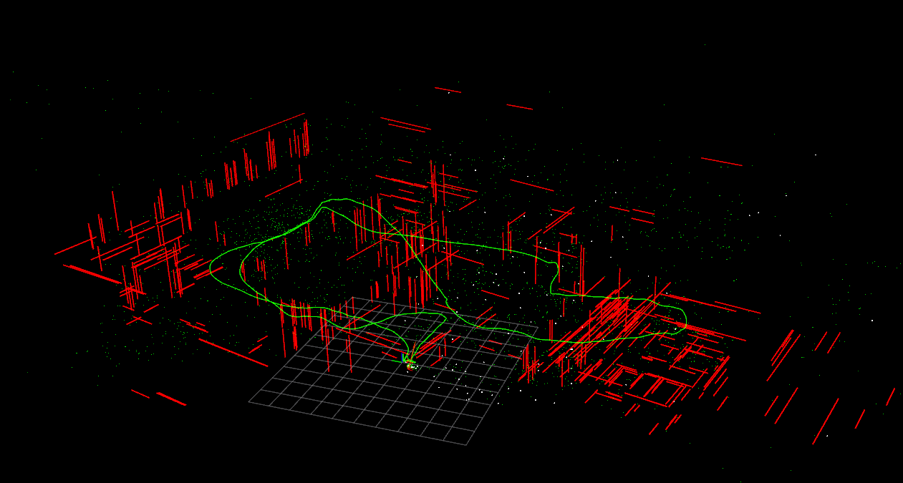
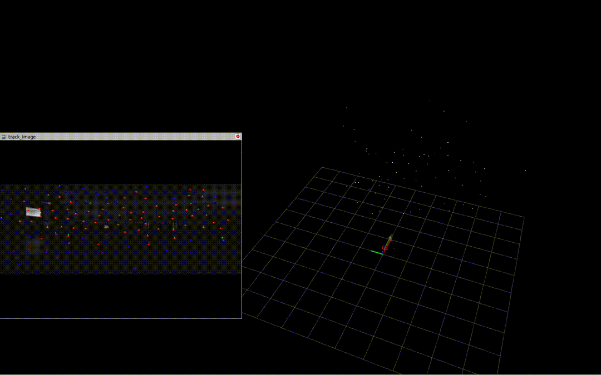
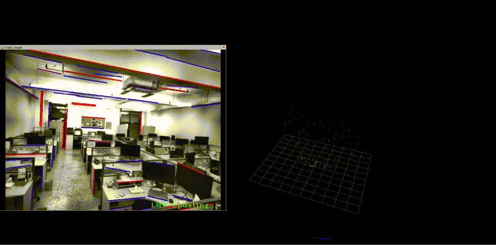

# VINS-PSL

VINS-PSL是面向低功耗边缘计算平台的点与结构线联合优化视觉惯性里程计，基于**VINS-Fusion**开发，测试平台为**Jetson Orin NX**。主要具备以下特性：
1. 在前端嵌入了主流的深度学习方法，包括**XFeat**、**Superpoint**、**Lightglue**，并利用TensorRT实现模型优化与部署。特征点提取与匹配的组合可以选用：**XFeat+LK**（推荐），Superpoint + LK、Superpoint + lightglue。经过测试，XFeat+LK的组合在鲁棒性和实时性上的综合表现最佳。同时，在前端加入LSD+LBD提取线特征以及描述子，采用knn实现帧间线特征匹配；
2. 为了充分利用XFeat输出的描述子，假设相邻特征点具有运动一致性，设计了局部区域匹配的特征点重跟踪算法，以提高特征点跟踪的鲁棒性；
3. 受**StructVIO**启发，基于亚特兰大世界假设对线特征进行建模，将线特征参数自由度由4压缩至2，从而构建隐含几何正交约束的线特征约束项，使得线特征更容易被优化的同时也提高了状态估计的精度。
- EuRoC-MH05测试效果(轨迹+地图)
 
&nbsp;
- 暗光环境，XFeat特征点跟踪效果（绿色箭头为光流，红色箭头为重跟踪）
 
&nbsp;
- 室内环境实机测试（Jetson Orin NX + RealSenseD435）
 
##  Prerequisites
**platform**: Jetson Orin NX with Jetpack 5.1.1
**dependencies**:
- ROS-Noetic
- OpenCV 4.5.4 With CUDA
- Ceres 2.0.0
- Eigen3
- TensortRT 8.5.2
- CUDA 11.4
## Build
```
cd ~/catkin_ws/src
git clone https://github.com/BKBKbbb/VINS-PSL.git
cd ../
catkin_make
source ~/catkin_ws/devel/setup.bash
```
## Run
当前所有测试都是在Jetson Orin NX平台下完成的，工程中所有tensorrt引擎文件也都是在Orin上生成的，因此无法被其他GPU架构的平台直接使用，不过本工程提供了对应的onnx模型，可以在其他GPU架构下重新生成tensorrt引擎。后续将提供Docker，以支持在其他平台上使用。
#### EuRoC Stereo + IMU
```
roslaunch vins rviz.launch
roslaunch superpoint euroc.launch
roslaunch vins euroc.launch
rosbag play MH_05_difficult.bag
```
#### Realtime Stereo + IMU
```
roslaunch vins rviz.launch
roslaunch superpoint superpoint_frontend.launch
roslaunch vins fast_drone_250.launch
```
## Reference
- VINS-Fusion: https://github.com/HKUST-Aerial-Robotics/VINS-Fusion
- StructVIO: https://github.com/danping/structvio
- AirSLAM: https://github.com/sair-lab/AirSLAM
